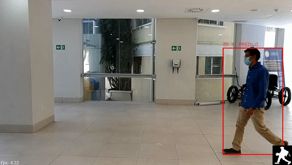
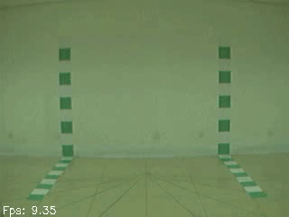
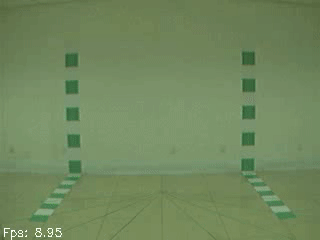
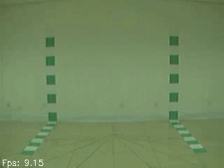

<h4 align="center">
  UCB SQUIRRELS
</h4>

<div align="center">
  <a href="#Description"><b>Description</b></a> |
  <a href="#Features"><b>Features</b></a> |
  <a href="#Requirements"><b>Requirements</b></a> |
  <a href="#Repository"><b>Repository</b></a> |
  <a href="#UCB-Squirrels team"><b>UCB-Squirrels team</b></a> |
</div>

## Description
This repository contains the material developed by the UCB-Squirrels team for the OpenCV 2021 Spatial AI competition. It is written in Python3 and uses `depthai` to interact with the OAKs.

<div align="center">
  
  <p align="center" ><i>Example of gait recognition using our own dataset.</i></p>
</div>

We also performed some test using the well known CASIA dataset.
- Auto-segmentation using a pretrained models
<div align="center">
    
  <p align="center" ><i>Gait recognition using the CASIA dataset</i></p>
</div>


## Features
- Pedestrian detection
- Image segmentation
- Human identification

## Requirements
The following libraries are necessary:
- depthai (follow the instructions in the official [repository](https://github.com/luxonis/depthai-python))
- opencv
- tensorflow 2
- Scikit-learn
- standard libraries: matplotlib, numpy, os, glob,
- OAKD_8S dataset which is a dataset that we collected. Download it in parts [part1](https://drive.google.com/file/d/1O6BXsYBZuQnCzyOV8C91qfat1rCE1W0w/view?usp=sharing) [part2](https://drive.google.com/file/d/1K5qibQ9ZnxotIo5aJV8ukhdi5WnSavrN/view?usp=sharing) [part3](https://drive.google.com/file/d/17HAN8nkvVwUbS7SiDdSpoM4_zaViqXYf/view?usp=sharing) [part4](https://drive.google.com/file/d/1yvb5aKrAd7vdeOweSkT_KwvXRwXqMIdw/view?usp=sharing) [main](https://drive.google.com/file/d/1HrmkPp3TMc7d1XeQoKYiEZxhwvxtO55L/view?usp=sharing)

## Repository
The directories are divided in the following way:
- recording: Contains scripts to record RGB and RGB+depth data using single or multiple OAK's-D.
- recognition: Contains scripts to perform Gait recognition using appearance information.
- segmentation: Contains scripts to perform instance segmentation, specifically person/human segmentation.
- models & data: Contain necessary data for prediction
- utils: It is composed of helping scripts

## UCB-Squirrels team
We are a group of researchers and lecturers from the Bolivian Catholic University.

<div align="center">
  
  <p align="center" ><i>Picture of our team taken after recording our dataset using five OAKs</i></p>
</div>

## Cite This Project

If you use this project in your research or wish to refer to the baseline results published in the README, please use the following BibTeX entry.

```bash
@misc{relabeller,
  author =       {UCB-Squirrels},
  title =        {Distributed Real-Time Gait Recognition usingOAK-D},
  howpublished = {\url{https://github.com/cidimec/UCB-squirrels}},
  year =         {2021}
}
```
